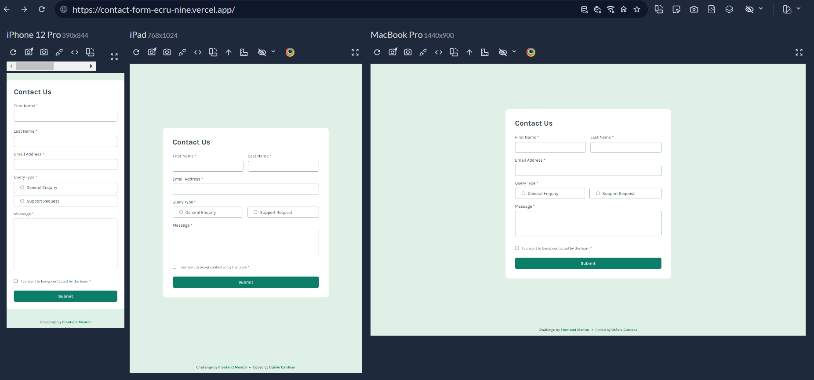

# Frontend Mentor - Contact form solution

This is a solution to the [Contact form challenge on Frontend Mentor](https://www.frontendmentor.io/challenges/contact-form--G-hYlqKJj). Frontend Mentor challenges help you improve your coding skills by building realistic projects. 

## Table of contents

- [Overview](#overview)
  - [The challenge](#the-challenge)
  - [Screenshot](#screenshot)
  - [Links](#links)
- [My process](#my-process)
  - [Built with](#built-with)
  - [What I learned](#what-i-learned)
  - [Continued development](#continued-development)
  - [AI Collaboration](#ai-collaboration)
- [Author](#author)

## Overview

### The challenge

Users should be able to:

- Complete the form and see a success toast message upon successful submission
- Receive form validation messages if:
  - A required field has been missed
  - The email address is not formatted correctly
- Complete the form only using their keyboard
- Have inputs, error messages, and the success message announced on their screen reader
- View the optimal layout for the interface depending on their device's screen size
- See hover and focus states for all interactive elements on the page

### Screenshot



### Links

- Solution URL: [repo](https://github.com/otaviozerotwo/Contact-form)
- Live Site URL: [deploy](https://contact-form-ecru-nine.vercel.app/)

## My process

### Built with

- Semantic HTML5 markup
- CSS custom properties
- Flexbox
- CSS Grid
- Mobile-first workflow
- [Parcel](https://parceljs.org/) - Build tool library
- [Sass](https://sass-lang.com/) - Preprocessor CSS
- [Toastify JS](https://apvarun.github.io/toastify-js/) - Toast JS library

### What I learned

In this challenge, I was able to practice manipulating the DOM with pure JavaScript, using methods such as `document.getElementById()`, `document.querySelector()`, `element.addEventListener()`, etc.

```js
const form = document.getElementById('form');

form.addEventListener('submit', (event) => {
  event.preventDefault();
  
  const isFormValid = validateForm();

  if (isFormValid) {
    form.reset()
    toast();
  }
});
```

I used `element.classList.add()` and `element.classList.remove()` to manipulate CSS classes via JavaScript, based on runtime validations:

```js
const inputError = (element, elementContainer) => {
  if (element.value === '') {
    elementContainer.classList.add('invalid-field');

    return false;
  } else {
    elementContainer.classList.remove('invalid-field');

    return true;
  }
}
```

I learned how to use simple transitions with CSS to simulate animations and make the rendering of error messages smoother:

```css
.error-message {
  display: block;
  max-height: 0;
  overflow: hidden;
  opacity: 0;
  padding-top: 0;
  transition: max-height 0.5s ease, opacity 0.5s ease, padding-top 0.5s ease;
}
```

I learned how to integrate an external toast library and how to customize it to suit the challenge's design:

```js
import Toastify from 'toastify-js';

const container = document.createElement('div');
const icon = document.createElement('img');
const titleContainer = document.createElement('div');
const title = document.createElement('h2');
const text = document.createElement('p');

container.classList.add('toast-container');

const imgPath = new URL('../assets/images/icon-success-check.svg', import.meta.url);
icon.src = imgPath.href;
icon.alt = '';

title.innerText = 'Message Sent!';
title.classList.add('toast-title');

text.innerText = 'Thanks for completing the form. We\'ll be in touch soon!';
text.classList.add('toast-text');

titleContainer.appendChild(icon);
titleContainer.appendChild(title);
container.appendChild(titleContainer);
container.appendChild(text);

const toast = () => {
  Toastify({
    node: container,
    duration: 5000,
    close: false,
    gravity: 'top',
    position: 'center',
    stopOnFocus: true,
    className: 'toast-position-mobile',
    style: {
      position: 'absolute',
      display: 'flex',
      justifyContent: 'center'
    }
  }).showToast();

  return Toastify;
}
```

### Continued development

I plan to practice more about DOM manipulation with JavaScript in the upcoming challenges.

### AI Collaboration

I used the Codex integrated into VSCode for brainstorming. Zero AI-generated code; I only asked for suggestions on code organization and how to position the toast on the screen according to the design.

## Author

- GitHub - [@otaviozerotwo](https://github.com/otaviozerotwo)
- Frontend Mentor - [@otaviozerotwo](https://www.frontendmentor.io/profile/otaviozerotwo)